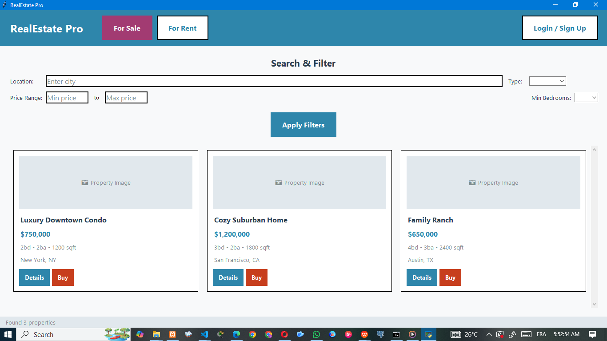
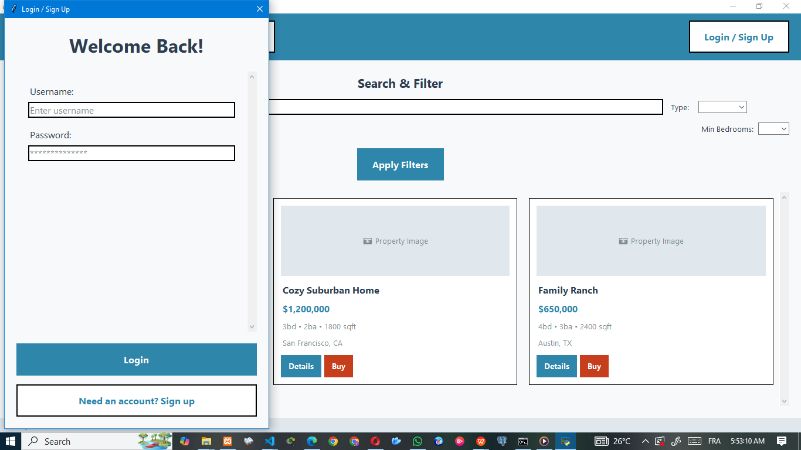
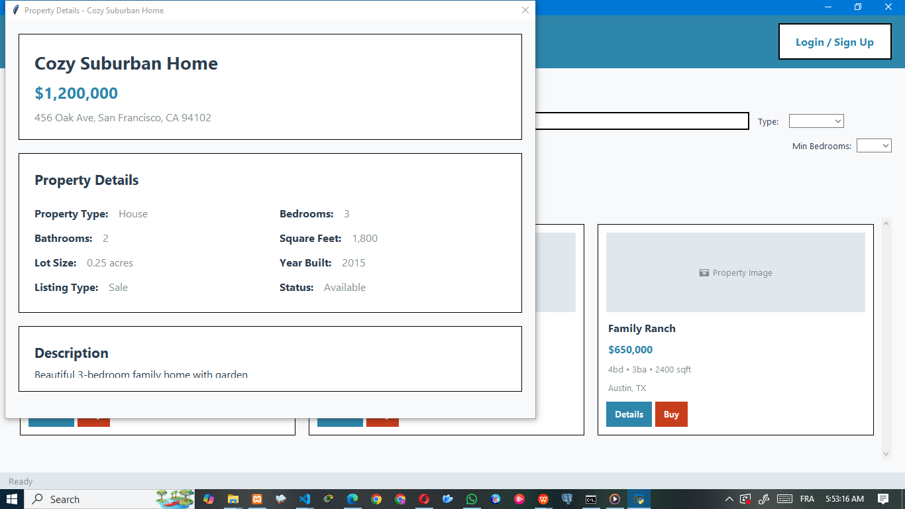

# RealEstate Pro - Complete Real Estate Management System

## Description

RealEstate Pro is a comprehensive real estate management application built with Python and Tkinter. It features both a customer-facing interface for browsing and purchasing/renting properties, and a complete back-office administration system for managing all aspects of the real estate business.

## Features

### Customer Interface
- Browse properties for sale and rent
- **Image Gallery**: View property images with thumbnail navigation
- Advanced search and filtering
- User registration and authentication
- **User Profile Management**: Edit profile, view statistics, manage favorites
- Property details with agent information
- Purchase and rental transactions
- **Enhanced Favorites System**: Add/remove favorites with visual feedback
- **My Transactions**: View transaction history

### Admin Back-Office System
- **Admin Dashboard**: Overview with key metrics and recent activity
- **Property Management**: Add, edit, delete, and manage all properties with image upload
- **User Management**: Manage user accounts, view statistics, activate/deactivate users
- **Transaction Management**: Monitor and manage all transactions, update statuses
- **Analytics Dashboard**: Comprehensive analytics with charts and reports
- **System Administration**: Complete control over the real estate platform

### Image Management System
- **Property Image Upload**: Support for multiple image formats (JPG, PNG, GIF, BMP)
- **Automatic Thumbnail Generation**: Optimized thumbnails for fast loading
- **Image Gallery**: Scrollable image galleries for properties
- **Primary Image Selection**: Set primary images for property listings
- **Image Management**: Add, remove, and organize property images

## Technologies Used

- Python 3
- Tkinter (GUI)
- MySQL (Database)
- `mysql-connector-python` (Python MySQL driver)
- **Pillow (PIL)** (Image processing and manipulation)
- Matplotlib (for analytics charts - optional)

## Project Structure

```
.
├── main.py                    # Main application entry point
├── config.py                  # Configuration settings
├── database.py                # Database management and all data operations
├── auth.py                    # Customer authentication
├── admin_auth.py              # Admin authentication
├── admin_dashboard.py         # Main admin dashboard
├── property_management.py     # Property CRUD operations
├── user_management.py         # User management interface
├── transaction_management.py  # Transaction monitoring and management
├── analytics_dashboard.py     # Analytics and reporting
├── property_details.py        # Property details window
├── ui_components.py           # Custom UI components
├── image_manager.py           # Image handling and management
├── user_profile.py            # User profile management
├── favorites_window.py        # Favorites management window
├── README.md                  # Project documentation
├── requirements.txt           # Python dependencies
├── images/                    # Image storage directory
│   ├── properties/            # Full-size property images
│   └── thumbnails/            # Generated thumbnails
└── capture/                   # Screenshots
    ├── HomePage.png
    ├── signIn.png
    ├── singnUp.png
    ├── detailsProperty.png
    └── unvailablefilter.png
```

## Admin Features

### Dashboard Overview
- Real-time statistics (total properties, users, transactions, revenue)
- Recent activity feed
- Quick access to all management modules
- System information

### Property Management
- View all properties in a searchable table
- Add new properties with complete details
- **Image Upload and Management**: Upload multiple images per property
- Edit existing property information
- Delete properties (with confirmation)
- Property status management (available, sold, rented, pending)
- **Image Gallery Management**: Set primary images, add/remove images

### User Management
- View all registered users
- User statistics (properties owned, transactions, favorites)
- Activate/deactivate user accounts
- Edit user information
- Delete users (with cascade deletion of related data)
- Add new users manually

### Transaction Management
- Monitor all transactions (purchases and rentals)
- Filter by status (pending, completed, cancelled) and type
- Update transaction statuses
- Cancel transactions (makes property available again)
- Delete transaction records
- View complete transaction details

### Analytics Dashboard
- Revenue analytics (total, monthly, yearly)
- Property performance metrics
- User growth statistics
- Sales conversion rates
- Top performing properties
- Market trends and insights

## Customer Features

### Enhanced Property Browsing
- **Image-Rich Property Cards**: Property listings with actual images
- **Detailed Property Views**: Full-screen image galleries with navigation
- **Advanced Filtering**: Search by location, type, price range, bedrooms
- **Responsive Grid Layout**: Optimized 3-column property grid

### User Account Management
- **Complete Profile System**: Edit personal information, change passwords
- **Activity Statistics**: View owned properties, transactions, favorites count
- **Transaction History**: Complete transaction history with details
- **Favorites Management**: Dedicated favorites window with easy management

### Enhanced Property Interaction
- **Smart Favorites System**: Add/remove with visual feedback
- **Improved Property Details**: Scrollable detailed view with image galleries
- **Quick Actions**: Direct buy/rent buttons on property cards
- **Agent Information**: Complete agent contact details

## Installation and Setup

### Prerequisites
- Python 3.7 or higher
- MySQL Server (XAMPP, WAMP, or standalone MySQL)

### Installation Steps

1. **Clone the repository:**
```bash
git clone https://github.com/Lucky-On-13/realestate-pro.git
cd realestate-pro
```

2. **Install required packages:**
```bash
pip install -r requirements.txt
```

3. **Set up MySQL database:**
   - Start your MySQL server (XAMPP/WAMP or standalone)
   - Update database credentials in `config.py`:
   ```python
   DB_HOST = "localhost"
   DB_PORT = 3306
   DB_NAME = "real_estate_db"
   DB_USER = "root"
   DB_PASSWORD = ""  # Set your MySQL password here
   ```

4. **Run the application:**
```bash
python main.py
```

The application will automatically:
- Create the database and all required tables
- Set up the image storage directories
- Populate sample data including properties and images

## Default Admin Credentials

When you first run the application, a default admin account is created:
- **Username:** `admin`
- **Password:** `admin123`

**Important:** Change these credentials immediately after first login for security.

## Usage

### For Customers
1. Launch the application
2. Browse properties using the "For Sale" or "For Rent" tabs
3. Use search filters to find specific properties
4. Click "Login / Sign Up" to create an account or log in
5. View property details with image galleries
6. Make transactions (purchase/rent properties)
7. Manage favorites and view your profile
8. Access your profile to view statistics and transaction history

### For Administrators
1. Click the "Admin" button in the top-right corner
2. Log in with admin credentials
3. Access the admin dashboard with all management tools
4. Use the different tabs to manage properties, users, and transactions
5. Upload and manage property images
6. View analytics and system reports

### Image Management
- **For Properties**: Upload multiple images when creating/editing properties
- **Supported Formats**: JPG, JPEG, PNG, GIF, BMP
- **Automatic Processing**: Images are automatically resized and thumbnails generated
- **Gallery Navigation**: Scroll through property images in detail view
- **Primary Image**: Set the main image that appears in property listings

## Database Schema

The application automatically creates the following tables:
- `admins` - Admin user accounts
- `users` - Customer accounts
- `properties` - Property listings
- `property_images` - Property image references and metadata
- `transactions` - Purchase and rental transactions
- `favorites` - User favorite properties

## Security Features

- Password hashing using SHA-256
- Admin and user role separation
- Input validation and sanitization
- SQL injection prevention through parameterized queries
- User session management
- Secure image upload with format validation
- File system security for image storage

## Performance Features

- **Optimized Image Loading**: Automatic thumbnail generation for fast loading
- **Efficient Database Queries**: Optimized queries with proper indexing
- **Responsive UI**: Smooth scrolling and navigation
- **Memory Management**: Proper image reference handling to prevent memory leaks
- **Lazy Loading**: Images loaded on demand for better performance

## Future Enhancements

- Advanced image editing tools
- Email notifications for transactions
- Advanced reporting with PDF export
- Property comparison features
- Map integration for property locations
- Mobile-responsive web interface
- API for third-party integrations
- Video support for property tours
- Advanced search with AI-powered recommendations

## Collaborators

- [Victoire Luc Ngami](https://github.com/Lucky-On-13)  
- [Espoir Assounga](https://github.com/collaborator-github-username)

## Repository

Project GitHub repository: [https://github.com/Lucky-On-13/realestate-pro.git](https://github.com/Lucky-On-13/realestate-pro.git)

## License

This project is licensed under the MIT License - see the LICENSE file for details.

## Support

For support or questions, please open an issue on the GitHub repository or contact the development team.

## Screenshots

### Customer Interface




### Admin Interface
The admin interface includes comprehensive dashboards for managing all aspects of the real estate business, with intuitive forms, image management tools, and data visualization capabilities.

### New Features Highlights
- **Rich Image Galleries**: Properties now display with actual images
- **Complete User Profiles**: Users can manage their accounts and view activity
- **Enhanced Admin Tools**: Full image management in property administration
- **Improved User Experience**: Modern, responsive interface with smooth interactions